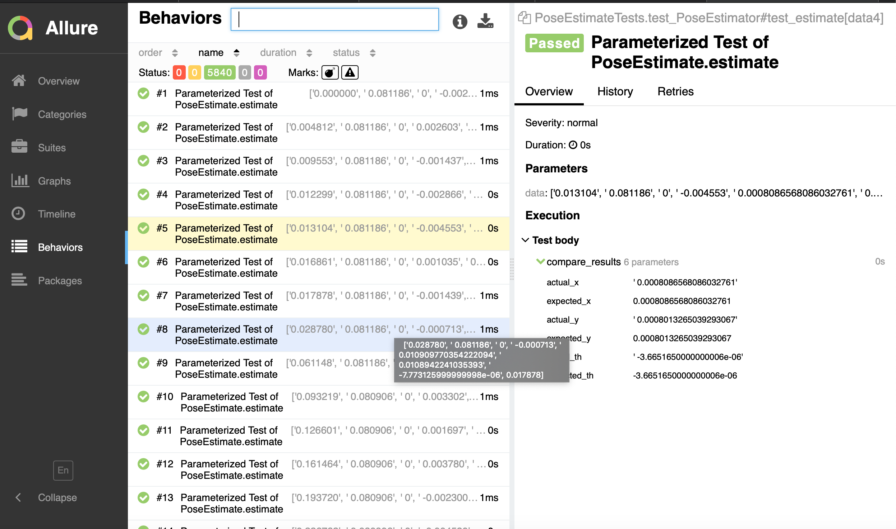

# PoseEstimator

Pose Estimator is a utility estimate the 2D position of the mobile 
platform (x, y, heading) based on odometry information.

# Assumptions
PoseEstimator.py accepts all the input dataset files with (current_time, steering_angle, encoder_ticks, angular_velocity)
from PoseEstimate/datasets and generate corresponding output dataset files under ../PoseEstimateTests/datasets with
(current_time, steering_angle, encoder_ticks, angular_velocity, X, Y, Th).
These output files are used to run the test and compare the results.
Here the output dataset files are considered to be the source of truth for now.

## Pre-requisite
* Requires Python2.7 and allure
* For MacOS
```bash
brew update
brew install allure
```
* For Unix
```bash
sudo apt-add-repository ppa:qameta/allure
sudo apt-get update 
sudo apt-get install allure
```
## Installation

* Unzip the PoseEstimator
```bash
cd PoseEstimator/
```
* Install All dependencies, issue following command
```bash
python setup.py install
```  

## Usage
* Generate output dataset files in ../PoseEstimateTests/datasets
```bash
cd PoseEstimate/
python PoseEstimator.py
```

## Test and Reporting

* To run tests and generate allure reports, issue the following commands.
* --dataset is a pytest config option with possible values
    1. dataset0 (Default)
    2. dataset1
    3. dataset2
    4. dataset3
    5. dataset4
    6. dataset5
* allure would open the browser and display the reports. For better understanding go to "Behaviors" section of the report.
```bash
cd ../PoseEstimateTests
pytest --junitxml=results.xml  --dataset=dataset0 --alluredir=my_allure_results
allure serve my_allure_results/
```
* Sample report after last command



